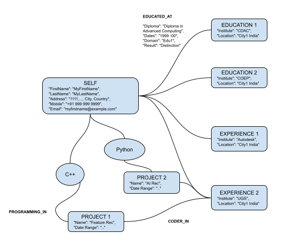

# Specs for 'Chatbot on Resumes'

Objective: Extract relevant information from resumes, build Knowledge Graph (KG) and build Chatbot on top of KG.

## Input
Resumes can be in docx, pdf or txt format. Following is a sample format after converting to text.

```
MyFirstName MyLastName 

Address: 1111, ColonyName, AreaName, Village, City, Country 
Mobile: +91 999 999 9999 
Email: myfirstname@example.com 

Summary:
12+ years in QA automation in various domains. Exploring a Senior Technical role.

Skills:
	Certifications: Certified Scrum Master, ISTQB 
	Programming: Python, Perl, Java 

Experience:
Sep 2015 	QA Manager, Company1, City1, India. 
Till Date 	- Responsible for managing a QA team: planning, execution of releases. Team size: 4.
			- UI automation and REST API automation using Selenium and Cucumber. 
			- Implemented Continuous Integration using Jenkins and headless browser. 
			- Python and shell scripting to automate QA tasks. 

:

Education:
1999 -00 Diploma in Advanced Computing, Edu1, City1, India, Distinction. 
:

Honors:
Multiple recognition in the form of Spot awards. 
:
```

## Output : Extraction
Extraction is not just NER (Named Entity Recognition) but also the structure ie composition or hierarchy of the content. Format is json ie list of nested dictionary objects.

```
"FirstName": "MyFirstName",
"LastName": "MyLastName",
"Address": "1111, ColonyName, AreaName, Village, City, Country",
"Mobile": "+91 999 999 9999",
"Email": "myfirstname@example.com",
"Summary": "12+ years in QA automation in various domains. Exploring a Senior Technical role",
"Skills": 
		{ 
			"Certifications": ["Certified Scrum Master", "ISTQB"],
			"Programming": ["Python", "Perl", "Java"]
		},
"Education": [
		{
			"Diploma": "Diploma in Advanced Computing",
			"Institute": "CDAC",
			"Dates": "1999 -00",
			"Domain": "Edu1", 
			"Location": "City1 India", 
			"Result": "Distinction"
		},
		{
		}
	],
"Experience": [
		{
			"Company": "Company1",
			"Dates": "1999 -00",
			"Designation": "QA Manager", 
			"Location: "City1 India", 
			"Projects": ["..", "..."],
			"Technologies": ["Python", "Perl"]
		},
		{
		}
	],	
"Honors":[]
```

## Output : Knowledge Graph
Design a Knowledge Graph schema, meaning which entities are nodes, which are edges, what are attributes on each, etc. 

- Nodes like SELF, will have attributes as address, email, phone etc
- All education colleges as nodes, their date ranges, marks, class etc on edge called education from SELF to that institution 
-  All work experience companies as nodes, their date ranges, designation etc on edge called experience from SELF to that company 
- Each company can have list of projects or products
- Each product can have list of technologies such as Cloud, C++ etc. These can be mentioned explicitly or can be dedeuded from text.
- Then there will be skill edge from SELF to C++

Possible schema is as below:

```
"Nodes": 
	[
		{
			"node_id": 1,
			"node_type": SELF,
			"attributes": 
			[
				"FirstName": "MyFirstName",
				"LastName": "MyLastName",
				"Address": "1111, ColonyName, AreaName, Village, City, Country",
				"Mobile": "+91 999 999 9999",
				"Email": "myfirstname@example.com",
				"Summary": "12+ years in QA automation in various domains. Exploring a Senior Technical role",
			]
			
		},
		
		{
			"node_id": 2,
			"node_type": EDUCATION,
			"attributes": 
			[
				"Institute": "CDAC",
				"Location": "City1 India", 
			]			
		},		
		{
			"node_id": 3,
			"node_type": EDUCATION,
			"attributes": 
			[
				"Institute": "COEP",
				"Location": "City1 India", 
			]			
		},		
		{
			"node_id": 4,
			"node_type": EXPERIENCE,
			"attributes": 
			[
				"Institute": "Autodesk",
				"Location": "City1 India", 
			]			
		},				
	],
"Edges":
	[
		{
			"edge_id": 1,
			"node_id_start": 1,
			"node_id_end": 2,
			"attributes": 
			[
				"Diploma": "Diploma in Advanced Computing",
				"Dates": "1999 -00",
				"Domain": "Edu1", 
				"Result": "Distinction"
			]
		},
		{
			"edge_id": 2,
		},
	]
```



Please note, node specific attributes are inside node and similarly for edges. e.g. the first education node "CDAC" has only location, it does not have date-range or result, as they are SELF specific. These will be as attributes from SELF to EDUCATION node, as shown in edge_id 1.

## Output : ChatBot

Assuming KG is ready, now we need to interact with it, in chatbot, using plain English. English will be transformed into SPARQL and then results will be fetched. Results will be transformed back into English. 
Large Language models can be trained for these conversions or if there are ready txt2SQL like frameworks, those can be leveraged
